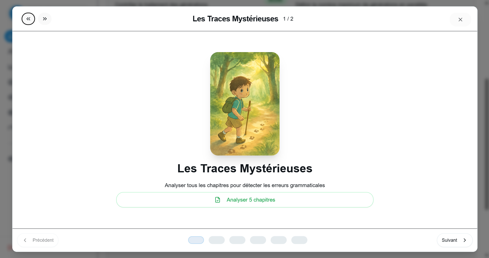

## Miabook

A production web platform that generates fully personalized children’s books with AI (story + illustrations), manages orders, and provides an internal dashboard with advanced analytics.

## Features

- **AI book generation**: multi‑step pipeline for summaries, chapters, covers and illustrations driven by OpenAI (text + image).
- **User accounts & auth**: Firebase‑based authentication (email, Google, Apple) with user groups and premium tiers.
- **Generation limits & quotas**: per‑user, per‑group and individual overrides with daily reset and detailed usage stats.
- **E‑commerce workflow**: cart, orders, payments, promo codes, book files, and optional print pipeline.
- **Back‑office dashboard**: manage users, books, generation queue, limits, illustration styles and quality.
- **Analytics**: global and per‑user metrics for generations, costs, revenues, conversions and cart behavior.
- **Resilience & monitoring**: background queues for book generation, error logging and manual recovery tools.

## Tech Stack

- **Frontend**:
  - React (main Miabook client)
  - React (internal admin / backoffice)

- **Backend**:
  - Node.js, Express
  - WebSocket / SSE for live book‑generation progress
  - MySQL with raw SQL + Prisma schema
  - Bull / job queues for async generation
  - Firebase Admin (auth, user metadata)
  - Monetico payment integration
  - SendGrid for transactional emails

- **AI / Tools**:
  - OpenAI API (GPT for text, gpt‑image‑1 for images)
  - Custom cost calculator using model pricing and token usage
  - AWS S3 for covers/illustrations and book assets
  - Custom analytics layer on top of SQL (costs, events, limits)

## Architecture

The project is organized around a single backend that serves both the public client and the internal dashboard, and orchestrates AI generation and storage:

```text
          ┌──────────────────────┐
          │  Miabook Client      │
          │  (Public React App)  │
          └─────────▲────────────┘
                    │ HTTPS + WebSocket/SSE
                    │
          ┌─────────┴────────────┐
          │  Miabook API Server  │
          │  (Node.js / Express) │
          └─────────▲────────────┘
                    │
     Admin HTTPS    │
          ┌─────────┴────────────┐
          │      Backoffice      │
          │  (Back‑office React) │
          └─────────▲────────────┘
                    │
     ┌──────────────┼───────────────────────────────┐
     │              │                               │
┌────┴─────┐  ┌─────┴──────┐                  ┌─────┴───────┐
│  MySQL   │  │  AWS S3    │                  │  OpenAI API │
│ (users,  │  │ (covers,   │  prompts, usage  │ (text/image │
│ books,   │  │  books,    │ ───────────────▶ │ generation) │
│ limits,  │  │  backups)  │ ◀─────────────── │             │
│ costs…)  │  └────────────┘   images, URLs   └─────────────┘
└──────────┘
```

- The **client app** calls the API for story creation, avatars, cart and orders, and listens to **WebSocket/SSE** updates for live generation progress.
- The **admin dashboard** uses dedicated routes (`/api/miabook-users`, `/api/analytics`, `/api/books-management`, `/api/limits`, etc.) to manage content, limits and analytics.
- The **server** coordinates OpenAI calls, persists costs and usage, and stores media & JSON data in **MySQL + S3**.

## Screenshots

### Backoffice overview




## Links

- **Frontend**: https://www.miabook.fr/
